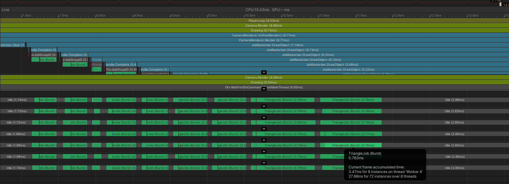
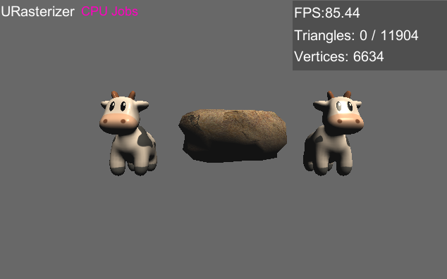
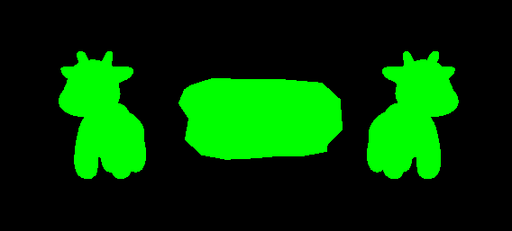
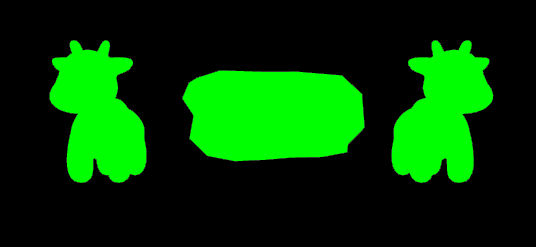
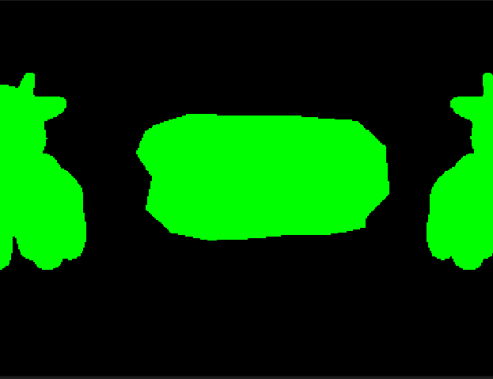

# URasterizer: 基于Unity平台的光栅化渲染器
本项目是在Unity上实现一套软件光栅化渲染，利用Unity的基础设施来读取模型、贴图，控制GameObject的变换，以及设置相机参数等，再通过软件光栅化来将场景渲染到一张贴图上。
URasterizer有三个独立的光栅化渲染器：
* CPU Rasterizer 完全使用C#编写，在CPU上实现的单线程软件光栅化
* CPU Job Rasterizer 使用Unity的Job System和Burst Compiler，使用多个处理器核心执行经过编译优化的光栅化代码，性能大幅提升。
* GPU Driven Rasterizer 使用Compute shader实现整个光栅化流水线。GPU Driven模式的性能和直接使用Unity渲染相当。

本项目的目的是学习研究光栅化以及利用多核和GPGPU加速光栅化，GPU Driven算法主要是针对小三角形比较有优势，并不适合通用的光栅化。

* 本项目github仓库地址：https://github.com/happyfire/URasterizer
* 图片不能显示请访问gitcode镜像仓库：https://gitcode.net/n5/urasterizer

# 支持特性
(部分仅CPU Rasterizer支持)
* Wireframe mode
* Frustum culling
* Clipping
* Backfarce culling
* Depth Test
* 基于重心坐标的光栅化
* 透视校正插值
* 可视化Depth Buffer
* MSAA
* 纹理采样模式 Nearest & Bilinear
* Blinn Phong着色
* 可视化顶点色
* 可视化法线
* 自定义几何图元
* 自定义顶点色

# 关于Job System
仅仅使用Job System就可以比单线程计算获得数倍的性能提升（测试场景中FPS从4提升到13）。将顶点处理和三角形处理两个过程使用并行Job实现，Unity Job System会自动调度到多个核心上执行。
使用Burst编译加速后，在同样的代码下，性能进一步提升（测试场景中FPS提升到85）。Profile中，每个triangle job的执行时间不到1ms，而不使用Burst时是20多ms。

# 关于GPU Driven
每个渲染物体组织相应的输入数据Compute buffer，渲染时分3个阶段启动compute shader kernel执行并行计算。中间计算的结果也保存在compute buffer中，不读回CPU内存，直接交下一阶段使用。
## 基本流水线
* Clear Frame Buffer阶段：针对每个像素分配一个线程进行clear操作
* 顶点处理阶段：针对每个顶点分配一个线程进行顶点变换
* 三角形处理阶段：针对每个三角形分配一个线程进行clipping, backface culling, 光栅化以及像素着色
## 存在的限制
* 由于是基于三角形分配线程，如果三角形很大，比如全屏后期处理的两个三角形，会造成性能急剧降低。
* 虽然每个物体是单独Dispatch的，但是CPU并不会等待同步，因此所有物体的所有三角形是并行的，因此无法指定渲染顺序，不支持半透明渲染。

# 项目截图
## 渲染控制选项

## CPU 渲染效果（BlinnPhong着色）

## Job System & Burst 加速

## GPU 渲染效果
### FPS极大提高

### 在测试机上，远远没到瓶颈，渲染更多的三角形也不影响帧率

## 线框模式，使用自定义顶点色

## 可视化顶点色

## 可视化法线

## 可视化深度缓冲

## MSAA
### 关闭MSAA

### MSAA 4x

### 关闭MSAA，局部放大

### MSAA 2x, 局部放大

### MSAA 4x，局部放大

